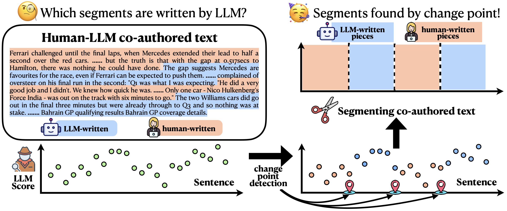

# [STAI-X 2026] Segmenting Human-LLM Co-authored Text via Change Point Detection ✨


This repository contains the official implementation of **[Segmenting Human-LLM Co-authored Text via Change Point Detection](https://arxiv.org/abs/2605.03723)** (accepted at **STAI-X 2026**).  

Our method provides a **change point detection** viewpoint on segmenting the human-LLM co-authored text (**Figure 1** 🧠). We leverage the hetergeneity among segments to design our method, achieves robust and state-of-the-art performance across a wide range of settings.

<figure style="margin: 0;">
  <p align="center" style="margin: 0;">
    
  </p>
  <p align="center" style="margin: -12px 0 0 0;">
    <sub><b>Figure 1.</b> 🧠 AUCs of various detectors on the WikiQA and Story datasets with varying lengths of input texts. RoBERTa and AdaDetectGPT are two training-based detectors, the others are zero-shot detectors.</sub>
  </p>
</figure>

## 🧭 Table of Contents
- [\[STAI-X 2026\] Segmenting Human-LLM Co-authored Text via Change Point Detection ✨](#stai-x-2026-segmenting-human-llm-co-authored-text-via-change-point-detection-)
  - [🧭 Table of Contents](#-table-of-contents)
  - [🛠️ Installation](#️-installation)
    - [Requirements](#requirements)
    - [Setup](#setup)
  - [🚀 Usage](#-usage)
  - [🎁 Additional Resources](#-additional-resources)
    - [Implemented baselines](#implemented-baselines)
    - [Reproducibility guide](#reproducibility-guide)
  - [📖 Citation](#-citation)

## 🛠️ Installation

### Requirements
- Python 3.10.8
- PyTorch 2.11.0
- CUDA-compatible GPU (experiments conducted on A100 with 40GB memory)

### Setup
```bash
./setup.sh
```

We also attach a `environment.yml` file to show our detailed configuration on the conda environment. 

## 🚀 Usage

Recommended for **off-the-shelf** usage: 

```bash
python scripts/detector_value_cp.py \
  --from_pretrained 'scripts/FineTune/ckpt/' \
  --phi NFT \
  --cp_method 'DP' \
  --power 2.0 \
  --cp_selection 'aic' \
  --weight_type 'invar' \
  --eval_dataset ${eval_data_path} \
  --output_file ${eval_result_path}
```

Make sure that your data is a `.json` file named `xxx.raw_data.json` with the following structure:

```python
{
  "sampled_sentence": [
    ["Sentence 1 of Document 1", "Sentence 2 of Document 1", ...], 
    ["Sentence 1 of Document 2", "Sentence 2 of Document 2", ...], 
    ...
  ],
  "source_label": [
    ["H", "H", ....], 
    ["L", "L", ...], 
    ...
  ], 
}
```
- `sampled_sentence` include a list of document whose each element is a list containing a series of sentences
- `source_label` include a list of document whose each element is a list containing a series of label of sentences, either `H` (human) or `L` (LLM)
- The two lists should typically be aligned in length (one-vs-one)

## 🎁 Additional Resources

The `scripts/` directory contains implementations of various LLM segmentation location methods from the literature. These implementations are designted to provide:
- consistent input/output formats
- simplified method comparison

### Implemented baselines

| Method                      | Script File            | Paper/Website                                                   |
| --------------------------- | ---------------------- | --------------------------------------------------------------- |
| **SenPred**            | `detect_naive_sp.py`    | [arXiv:2510.01268](https://arxiv.org/abs/2510.01268)            |
| **Voting**               | `detect_voting_sp.py`  | [EMNLP-main.463](https://aclanthology.org/2023.emnlp-main.463/) |
| **PaLD**              | `detect_pald.py` | [arXiv:2401.12070](https://arxiv.org/abs/2401.12070)            |
| **TextTilling** | `detect_texttilling.py`    | [arXiv:1908.09203](https://arxiv.org/abs/1908.09203)            |


### Reproducibility guide
- `exp_longdocs.sh`: generate results of Figure 1, then run `python exp_longdocs/plot_length.py` to get Figure 1
- `exp_single_cp.sh`: generate results of Table 1, then run `python exp_single_cp/1table.py` to get Figure 1
- `exp_vary_paralen.sh`: generate results of Table 2, then run `python exp_vary_paralen/show_results.py` to get Table 2


## 📖 Citation

If you find this work useful, please consider citing our paper:

```bibtex
@inproceedings{li2026segmenting,
  title={Segmenting Human-LLM Co-authored Text via Change Point Detection},
  author={Mengchu Li and Jin Zhu and Jinglai Li and Chengchun Shi},
  booktitle={Statistics and Trustworthy AI for Cross (X)-Domain Acceleration},
  abbr={STAI-X},
  year={2026},
}
```

If you have any questions, please feel free to open an [issue](https://github.com/Mamba413/DetectLLMSegmentation/issues).
